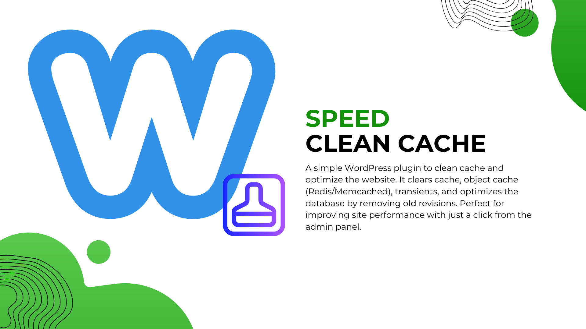
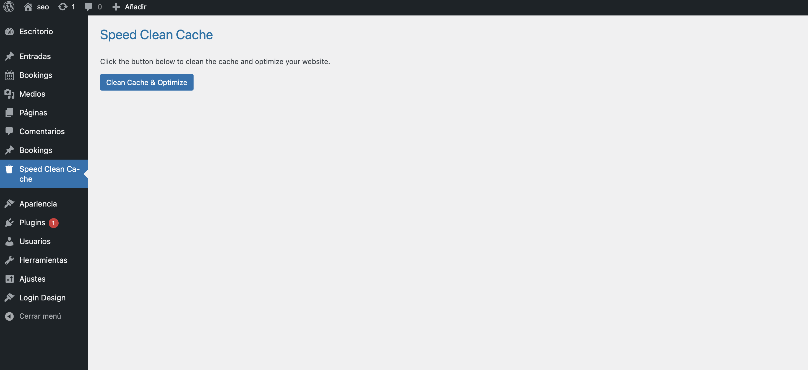

# Speed Clean Cache Plugin

A simple WordPress plugin to clean cache and optimize your website with a click from the admin panel. It clears WordPress cache, object cache (Redis/Memcached), transients, and optimizes the database by cleaning up revisions.

## Features:
- Clean WordPress cache
- Flush object cache (Redis/Memcached)
- Clear expired transients
- Optimize the WordPress database

## Screenshots:

_This screenshot shows the settings page of the plugin._

## Installation:

1. Download the plugin files.
2. Upload the `speed-clean-cache` folder to your `wp-content/plugins/` directory.
3. Go to the WordPress admin panel.
4. Activate the "Speed Clean Cache" plugin from the Plugins menu.

## Usage:
1. After activation, a new menu item "Speed Clean Cache" will appear in the admin panel.
2. Click on it to access the admin page.
3. Click the "Clean Cache & Optimize" button to clear the cache and optimize the database.

## Contributing:
1. Fork the repository.
2. Create a feature branch.
3. Make your changes.
4. Open a pull request with a clear description of your changes.

## License:
This plugin is licensed under the [GPL2 License](LICENSE).

## Author:
- **Hamid Ezzaki**
- Website: [https://siteweb.es](https://siteweb.es)
